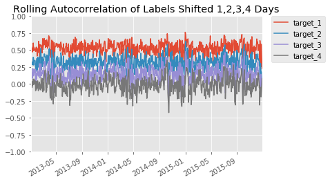

# Combining Alpha Signals
---

This project builds off the [factor model project](https://github.com/keniba/factor_model) where a simple mean was used to combine the alpha signals, here: 
 - additional features are added such as date, regime, stock volatilitity
 - the signals are combined using a random forest for enhanced alpha
 - demonstrates how to address overlapping labels issue (rolling autocorrelation) with DTs/Random Forests

 

---

**note**: end of day data from Quotemedia, and sector data from Sharadar was used which could not be shared due to licensing restrictions
